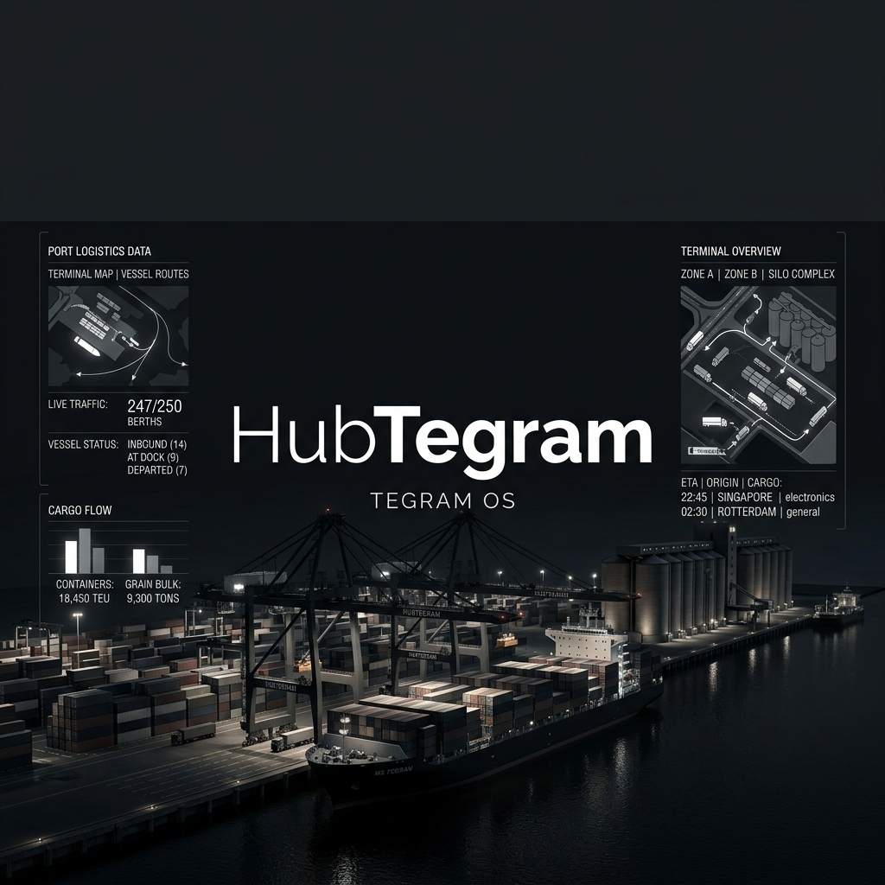

<div align="center">
  
</div>

<!-- theme switcher integrated -->
# HubTegram — TEGRAM OS

O **HubTegram** (TEGRAM OS) é uma suíte integrada de operações portuárias de alta fidelidade desenvolvida para o **TEGRAM Itaqui** (Terminal de Grãos do Maranhão), localizado em São Luís. 

Este projeto serve como o cockpit operacional digital para o **Operador Sênior Evanildo de Jesus Campos Barros**, otimizando a logística de campo, a gestão de conformidade de segurança e saúde ocupacional (SSO), os treinamentos corporativos e o monitoramento ambiental e social (ESG) do porto.

---

## 📋 Escopo Geral e Funcionalidades

O sistema foi desenhado de forma responsiva com foco em usabilidade móvel e no dia a dia do operador de campo, dividindo-se em quatro pilares fundamentais:

### 1. Cockpit Central (Dashboard)
* **Painel Principal**: Visão geral de status das correias transportadoras, moegas e câmeras de monitoramento ao vivo.
* **Tegram Assistente**: Um assistente virtual conversacional baseado em Inteligência Artificial (**Gemini 3.5 Flash via Vertex AI**) altamente contextualizado para as operações do TEGRAM, segurança do trabalho (NR-15, NR-16, NR-29, NR-35) e apoio rápido para tomada de decisão no porto.

### 2. Gestão de SSO, Terceiros e EAD
* **Validação de Terceirizados**: Pré-cadastro digital de funcionários contratados, validação de ASOs (Atestados de Saúde Ocupacional) e certificados.
* **Escola EAD**: Módulo integrado para vídeo-aulas regulamentares, simulados de segurança com correção em tempo real e download de materiais didáticos digitais.
* **Prevenção Trabalhista**: Alertas automáticos para exames e treinamentos vencendo nos próximos 30 dias.

### 3. Vistorias de Campo e Ações
* **Checklists Digitais**: Registro fotográfico de inspeções diretamente pelo celular, substituindo a montagem manual de relatórios em PowerPoint.
* **Planos de Ação**: Disparo automático de não-conformidades críticas (como necessidade de capina ou reparo estrutural) para os supervisores das respectivas áreas.

### 4. Monitoramento ESG
* **Pegada Ambiental**: Acompanhamento mensal de emissões de CO2 ($tCO_2e$) e eficiência energética.
* **Gestão de Resíduos**: Indicadores de taxa de reciclagem e separação de materiais.
* **Segurança Operacional**: Contador de horas trabalhadas sem acidentes.

---

## 🛠️ Tecnologias Utilizadas

O HubTegram é uma aplicação moderna baseada em componentes minimalistas e alta reatividade:

* **Frontend**: React 19, TypeScript, Vite 6, Tailwind CSS v4, Motion (animações e micro-interações).
* **Backend**: Node.js + Express (atuando como servidor local de arquivos e proxy de rotas de IA).
* **Inteligência Artificial**: SDK oficial do Google GenAI (`@google/genai`) conectado ao **Vertex AI** (com fallback para API Key).

---

## 🚀 Como Executar Localmente

### Pré-requisitos
* Node.js (versão 18 ou superior)
* Google Cloud SDK (`gcloud`) instalado e autenticado
* Projeto Google Cloud com API Vertex AI habilitada

### Passos para Inicialização

1. **Instale as dependências**:
   ```bash
   npm install
   ```

2. **Configure a Autenticação do Google Cloud**:
   ```bash
   gcloud auth application-default login
   ```

3. **Configure o Ambiente**:
   Copie o arquivo de exemplo `.env.example` para `.env` e defina seu projeto:
   ```bash
   cp .env.example .env
   ```
   Abra o arquivo `.env` e configure o Vertex AI:
   ```env
   GOOGLE_CLOUD_PROJECT="seu-project-id"
   GOOGLE_CLOUD_LOCATION="us-central1"
   GOOGLE_GENAI_USE_VERTEXAI="true"
   ```
   > **Nota**: Se preferir usar uma API Key do Gemini como alternativa, defina `GOOGLE_GENAI_USE_VERTEXAI="false"` e configure `GEMINI_API_KEY`.

4. **Inicie o servidor de desenvolvimento**:
   ```bash
   npm run dev
   ```
   A aplicação estará disponível no endereço: **[http://localhost:3000](http://localhost:3000)**.

---

## 🔒 Segurança e Contribuição

* **Gestão de Segredos**: Nunca envie arquivos `.env` ou tokens pessoais (`ghp_...`) para o histórico do Git. O repositório usa arquivos `.gitignore` configurados para proteção.
* **Desenvolvido para**: Porto de Itaqui - TEGRAM.
* **Liderança Técnica de Operações**: Evanildo de Jesus Campos Barros.
